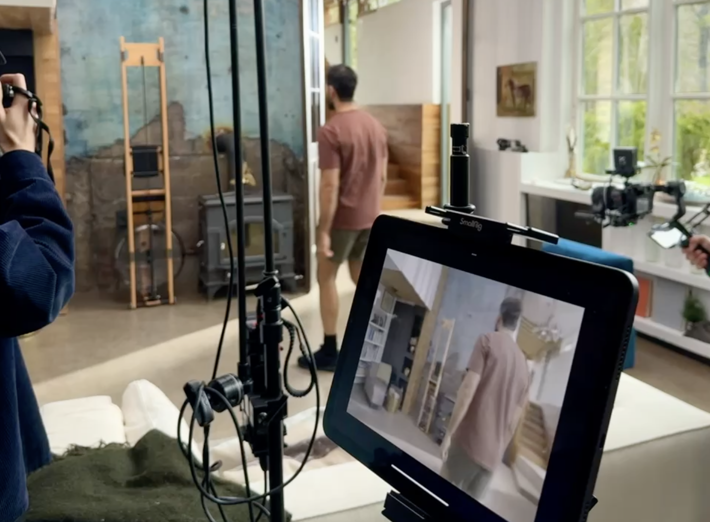
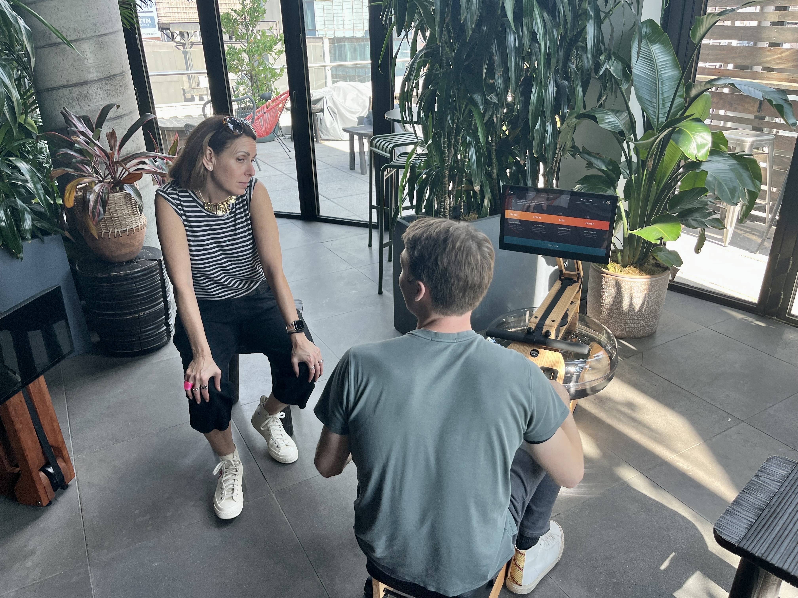

I introduced the Ergatta Lite — even more beautiful to photograph, and a full
$1,000 less — before the holidays with a <a
href="https://www.cnn.com/cnn-underscored/health-fitness/ergatta-lite"
rel="noopener noreferrer" target="_blank">CNN Underscored</a> exclusive.

It was a no-brainer: our core market was deeply rooted, but we wanted to address
a larger, more competitive consumer base with a lower upfront cost. Working in
tight coordination with the product, engineering, and physical engineering teams,
we created the Ergatta Lite from scratch in six months.

Leading the campaign end-to-end, I set up two shoots for studio and lifestyle
content and unveiled a wider marketing strategy that re-envisioned Ergatta's
website and its paid and organic presence, shifting from a one-product company to
a multi-product brand with bundles, add-ons, and up-value opportunities. In the
months leading up to launch, I hosted editors at the MADE Hotel in Flatiron for a
demo week, where I negotiated placements and landed an exclusive story.

The Ergatta Lite immediately became a sensation. It made up over 60% of Ergatta's
conversions at a similar margin, with over half of buyers adding very-high-margin
add-ons.
