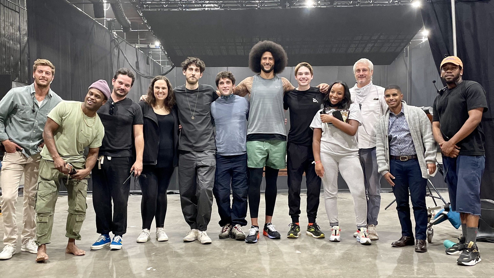
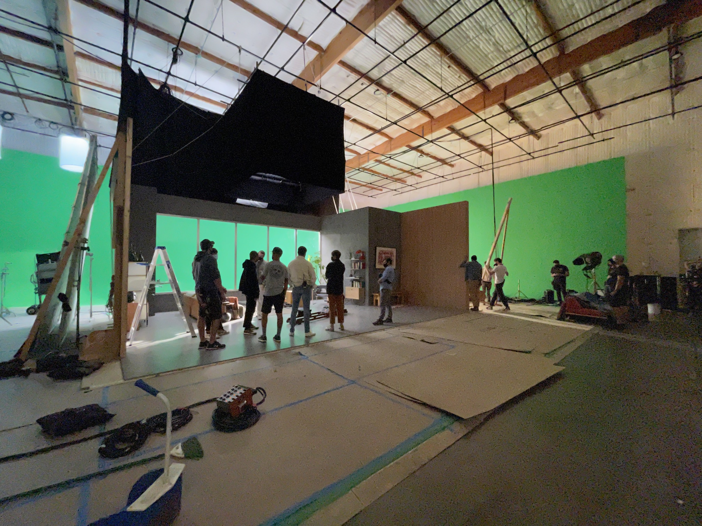

In 2021, Ergatta tapped seed investor Colin Kaepernick to stir up awareness for
the upcoming holiday season in our first dedicated brand partnership: "Game On."
I managed the campaign, personally teaching Colin to row, and running a 77-person
production crew in coordination with our creative partners at PDA agency.

Calling back to the 1989 Apple ad, "Game On" draws the viewer to imagine a new
way to exercise — with the intensity and drive of competition, and without the
empty pep of a studio class. Setting up in a Simi Valley studio, we constructed
an apartment scene and suspended a 10,000 lb LED screen over a 40' x 40'
reflection pool to bridge a pathway between the digitally rendered gameplay and
Colin's surroundings.

We executed this campaign across paid and earned media channels, inevitably
angering a few Kaepernick non-supporters but, most importantly, galvanizing our
core market and doubling November–December sales year over year.

