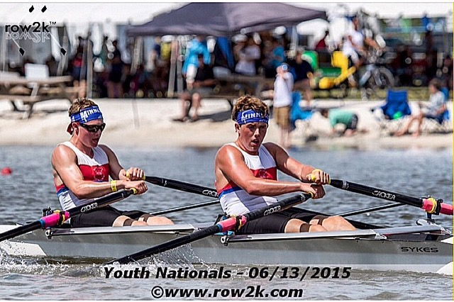
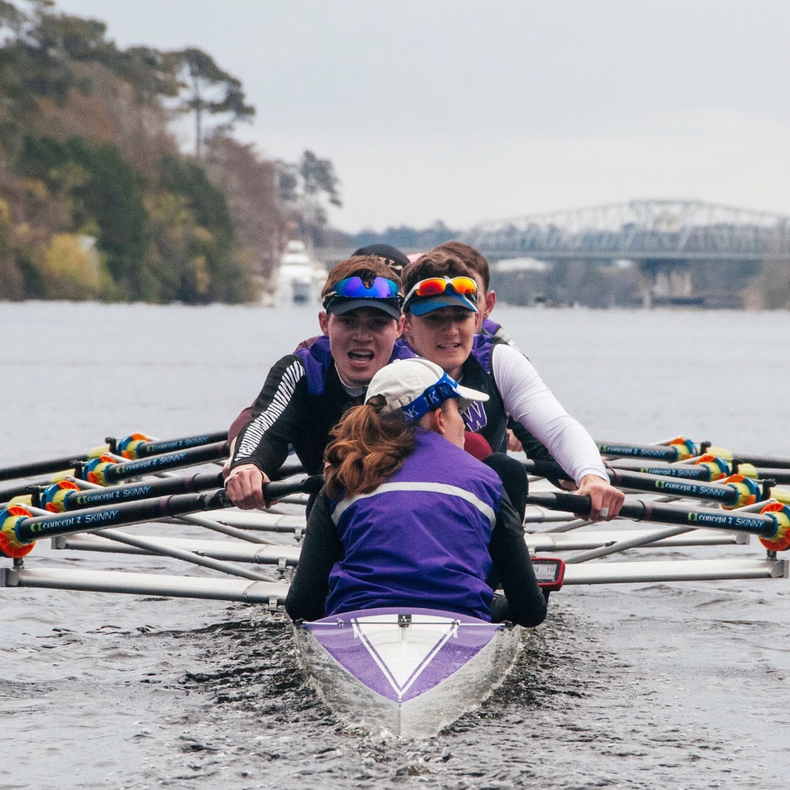
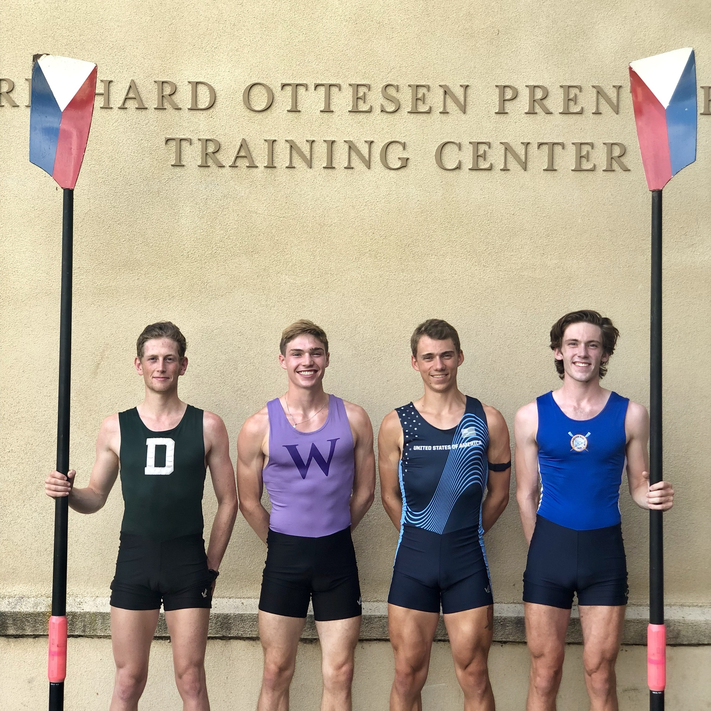

I started rowing by accident. It was 2013, and I picked up an oar for the first
time, not even realizing it was different from kayaking. Immediately, I was
infatuated with the sport: how it fed my love of being on the lake, the thrill of
racing, the mental boxing match, the feeling of progression over time, and
actually growing from a scrawny boy into one of the fastest in the nation.

My first rowing team folded within just six months. Turns out the head coach
wasn't the best guy and skipped town with the boats and our bank account. In
Minnesota, where I grew up, there are only about six rowing clubs — and it's a
large state. So a core group of teammates and I founded Long Lake Rowing Crew in
its place, establishing a 501(c)(3) board and a presence with the city council.
We partnered with local business leaders to convert the broken-down picture frame
store we were training in into a CrossFit gym, and the boarded-up lakeside
restaurant whose parking lot we occupied into a supper club, brewery, and vibrant
rowing club that continues to operate at a 100-youth-rower capacity.

At Williams College, on a mountain lake in the Berkshires, I had the joy of
rowing stroke seat in the first freshman boat and then in the first varsity boat
for three years, finishing my time there as captain.

In 2019, I was invited to try out for the U23 National Team Selection Camp, where
36 of the fastest collegiate rowers slimmed down to 160 lbs. to fight for four
slots in the United States lightweight men's quad at the World Championships. We
were whittled down three times a day on Princeton's Lake Carnegie, where I
enjoyed some of the most exciting and grueling racing of my entire life. I made
the boat in the end, rowing the two-seat, and placing fourth internationally.

